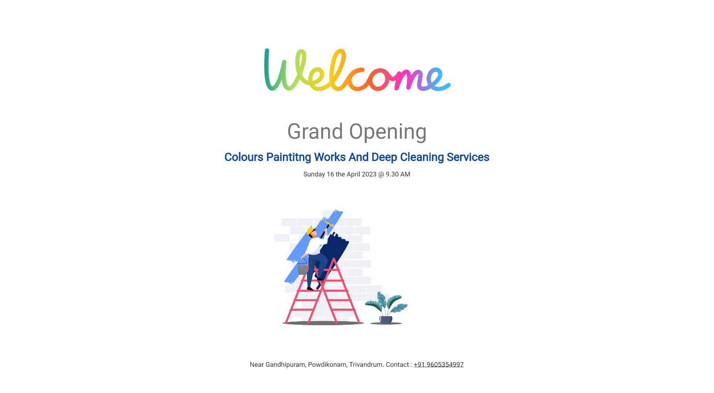

# Shop Invitation Web Page 

The web page is likely to include information about the date, time, and location of the opening ceremony, as well as any special events or promotions that may be taking place during the event. The page may also provide details about the shop's products or services, along with photos or videos that showcase the shop's offerings.

Given that the purpose of the web page is to invite people to the shop opening ceremony, it is essential that the page is visually appealing, easy to navigate, and provides all the necessary information that potential attendees may need. The use of Flutter may be particularly useful for creating a visually attractive and responsive design, while Firebase's hosting services can ensure that the web page is accessible to all users, regardless of their location or device.

In summary, the web page hosted on Firebase with Flutter is intended to serve as an invitation to a shop opening ceremony. The page is likely to include information about the event and the shop's offerings, and will be designed to be visually engaging and easy to use.

